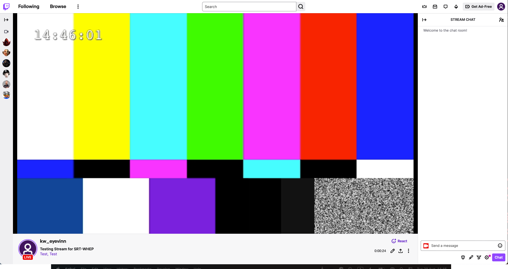

# SRT to RTMP
This application ingests one MPEG-TS over SRT stream and outputs as RTMP stream. Example of use cases:

- Stream SRT content to Twitch or YouTube Live

Supports SRT streams in caller and listener mode.
Runs on MacOS and Ubuntu.



## Compliance Table
Here we have a list of supported production software.

| Source Type       | Supported            | Details                                  |
|-------------------|----------------------|------------------------------------------|
| FFMpeg            | :white_check_mark:   | Supports as input source                 |
| OBS               | :white_check_mark:   | Supports as input source                 |
| Twitch            | :white_check_mark:   | Supports streaming to Twitch             |
| YouTube live      | :white_check_mark:   | Supports streaming to Youtube Live       |

## Install

```
cargo install srt_rtmp

# recommended for pretty log viewer (optional)
cargo install bunyan
```

Generate an SRT test source for example using our testsrc Docker container:

```
docker run --rm -p 1234:1234/udp eyevinntechnology/testsrc
```

An SRT stream (in listener mode) is then available at `srt://127.0.0.1:1234`. 

Set your Stream key as ENV `STREAM_KEY`. Then run the `srt-rtmp` application:

```
export STREAM_KEY=$YOUR_STREAM_KEY

srt-rtmp -i 127.0.0.1:1234 -s caller -o live.twitch.tv/app | bunyan
```

It will connect to the SRT test stream in caller mode as the generated SRT stream is in listener mode.
A live stream will be available at `rtmp://live.twitch.tv/app/$STREAM_KEY`.

## Build from Source
### OSX

Requirements:
- XCode command line tools installed
- GStreamer [binaries](https://gstreamer.freedesktop.org/data/pkg/osx/) from GStreamer's website installed
- Rust and cargo installed

Make sure you have the following env variables defined:

```
export PATH=$PATH:/Library/Frameworks/GStreamer.framework/Versions/Current/bin
export PKG_CONFIG_PATH=/Library/Frameworks/GStreamer.framework/Versions/Current/lib/pkgconfig
export GST_PLUGIN_PATH=/Library/Frameworks/GStreamer.framework/Versions/Current/lib
export DYLD_FALLBACK_LIBRARY_PATH=$GST_PLUGIN_PATH
```

Build with Cargo

```
cargo check
cargo install bunyan # Optional, for pretty printing of logs
cargo build --release
```

The binary is then available at `./target/release/srt-rtmp`. See below for how to run it.

### Debian (bullseye / bookworm)

Requirements:
- Rust and cargo installed

Install GStreamer build dependencies.

```
apt-get update
apt-get -y install build-essential \
  curl \
  pkg-config \
  libssl-dev \
  libunwind-dev \
  libgstreamer1.0-dev \
  libgstreamer-plugins-base1.0-dev \
  libgstreamer-plugins-bad1.0-dev \
  gstreamer1.0-plugins-base \
  gstreamer1.0-plugins-good \
  gstreamer1.0-plugins-bad \
  gstreamer1.0-plugins-ugly \
  gstreamer1.0-libav \
  gstreamer1.0-tools \
  gstreamer1.0-x \
  gstreamer1.0-alsa \
  gstreamer1.0-gl \
  gstreamer1.0-gtk3 \
  gstreamer1.0-qt5 \
  gstreamer1.0-pulseaudio \
  gstreamer1.0-nice
```

Build with Cargo

```
cargo check
cargo install bunyan # Optional, for pretty printing of logs
cargo build --release
```

The binary is then available at `./target/release/srt-rtmp`. See below for how to run it.

## License (Apache-2.0)

Copyright 2023 Eyevinn Technology AB

Licensed under the Apache License, Version 2.0 (the "License");
you may not use this file except in compliance with the License.
You may obtain a copy of the License at

    http://www.apache.org/licenses/LICENSE-2.0

Unless required by applicable law or agreed to in writing, software
distributed under the License is distributed on an "AS IS" BASIS,
WITHOUT WARRANTIES OR CONDITIONS OF ANY KIND, either express or implied.
See the License for the specific language governing permissions and
limitations under the License.

## Support

Join our [community on Slack](http://slack.streamingtech.se) where you can post any questions regarding any of our open source projects. Eyevinn's consulting business can also offer you:

- Further development of this component
- Customization and integration of this component into your platform
- Support and maintenance agreement

Contact [sales@eyevinn.se](mailto:sales@eyevinn.se) if you are interested.

## About Eyevinn Technology

Eyevinn Technology is an independent consultant firm specialized in video and streaming. Independent in a way that we are not commercially tied to any platform or technology vendor.

At Eyevinn, every software developer consultant has a dedicated budget reserved for open source development and contribution to the open source community. This give us room for innovation, team building and personal competence development. And also gives us as a company a way to contribute back to the open source community.

Want to know more about Eyevinn and how it is to work here. Contact us at work@eyevinn.se!
